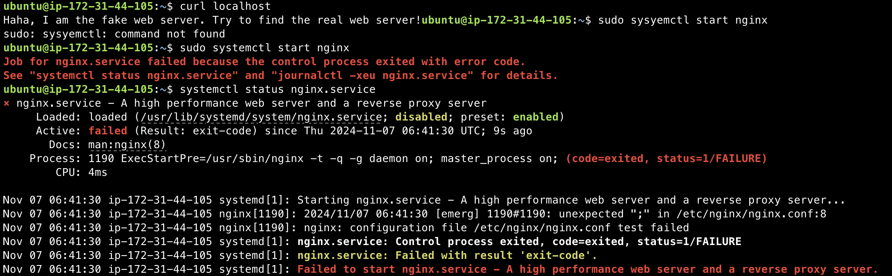
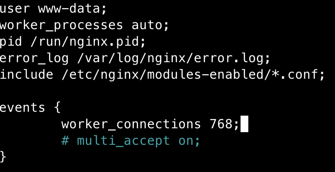
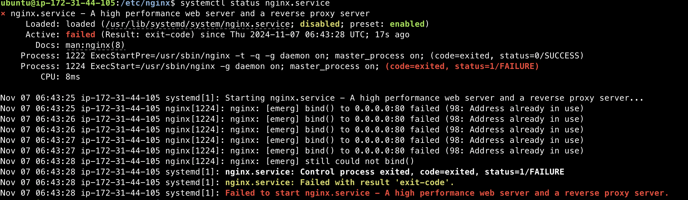
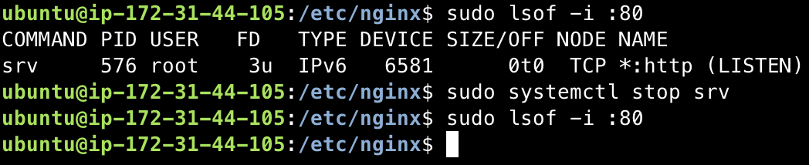
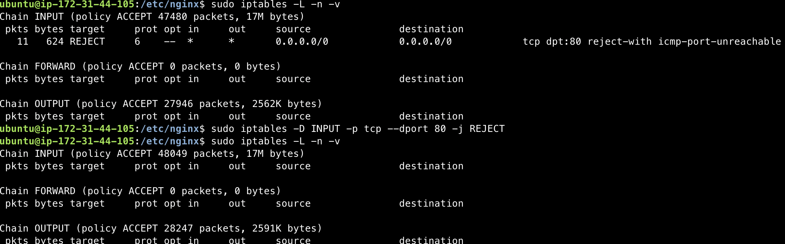
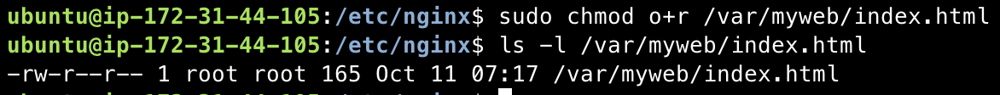
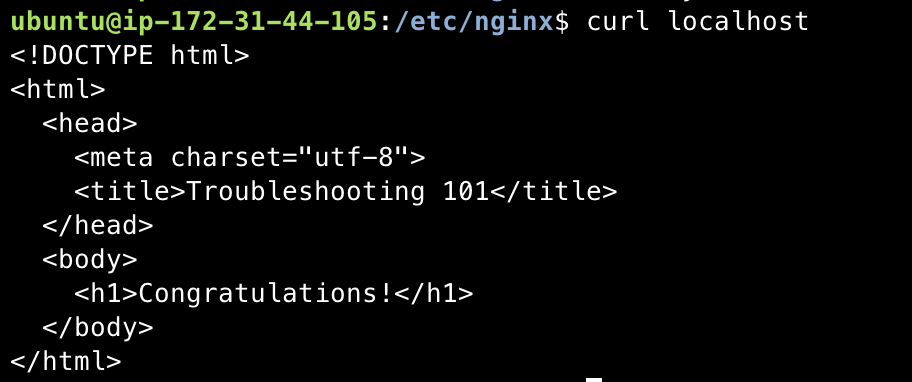
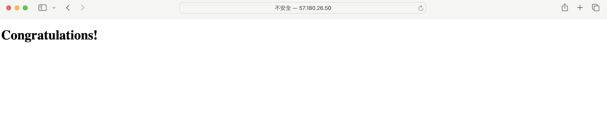

# 驗屍報告
- 開啟 nginx 發現錯誤訊息，根據錯誤訊息得知 nginx.conf 第八行多了個分號
> 
- 刪除多餘的分號
> 
- 發現 80 port 被佔用
> 
- kill 佔用 80 port 的程序
> 
- 發現防火牆擋住 80 port，開啟 80 port
> 
- 修改 index.html 的權限
> 
- 可以成功 curl localhost
> 
> 